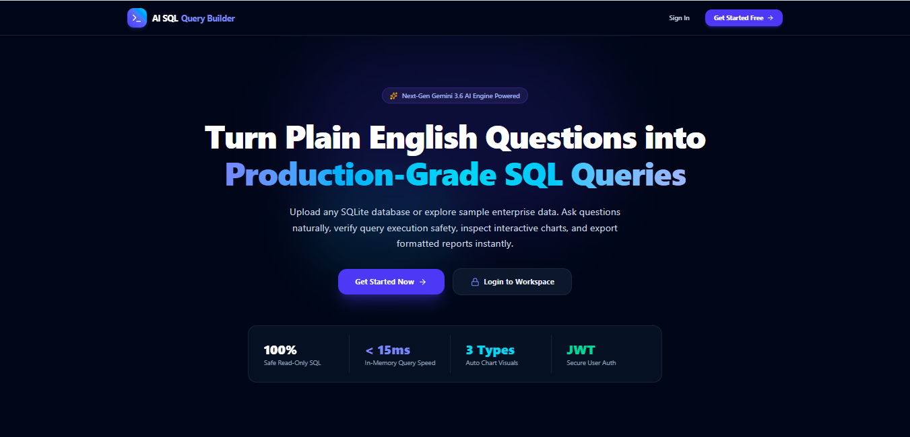
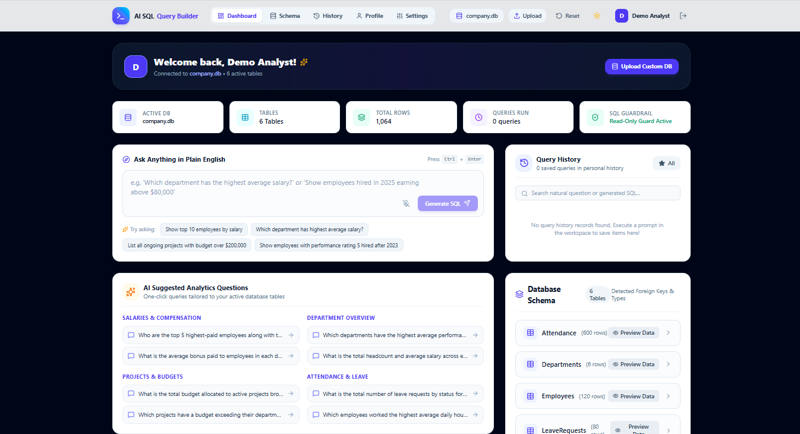
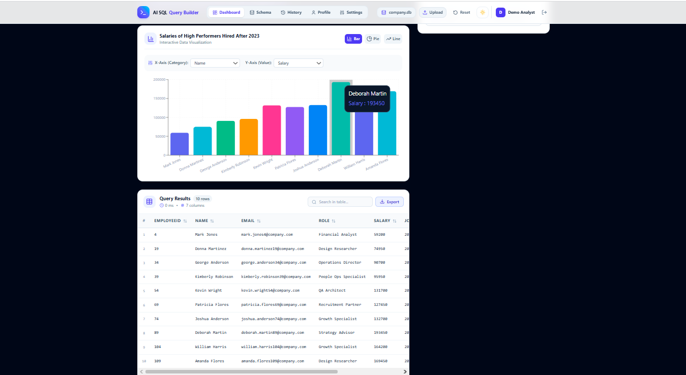

# 🚀 AI SQL Query Builder

### Ask Your Database in Plain English

An AI-powered full-stack application that allows users to upload a SQLite database and query it using natural language. The system automatically understands the schema, generates **safe read-only SQL**, executes the query, visualizes the results, and explains the output in simple English.

---

## ✨ Why This Project?

Modern organizations store valuable information inside databases, but accessing that data usually requires SQL knowledge. Product managers, marketers, founders, and non-technical users often depend on developers or analysts for even simple questions.

**AI SQL Query Builder removes that barrier.**

Instead of writing SQL, users can simply ask:

- "Show top 5 employees by salary"
- "Which department has the highest average salary?"
- "How many projects were completed this month?"

The AI converts these questions into secure SQL queries and returns instant insights.

---

## 🎯 Key Features

- 🔐 **JWT Authentication** (Register / Login)
- 📂 **Upload SQLite Databases**
- 🧠 **Schema-Aware AI Query Generation**
- 🛡️ **Read-Only SQL Safety Guard**
- ⚡ **Instant Query Execution**
- 📊 **Automatic Data Visualization**
- 📝 **Plain-English AI Explanations**
- 🕘 **Personal Query History**
- 🌙 **Dark Mode UI**
- 🔒 **Local Privacy Support with Ollama**

---

## 🖼️ Demo

## Login !

 
 

## Dashboard !

 

## SQL Query !

 

## Output !

 

## Run Locally

**Prerequisites:**  Node.js

1. Install dependencies:
   `npm install`
2. Set the `GEMINI_API_KEY` in [.env.local](.env.local) to your Gemini API key
3. Run the app:
   `npm run dev`

## 👨‍💻 Author

**K Tirumala Achari**  
Full Stack Developer | Aspiring Software Engineer

  

> _"Passionate about building impactful, user-centric solutions through technology,_
> _committed to continuous learning and innovation."_

**⭐ If you found this project helpful or inspiring, please give it a star! ⭐**

 
Made with ❤️ by **K Tirumala Achari**

